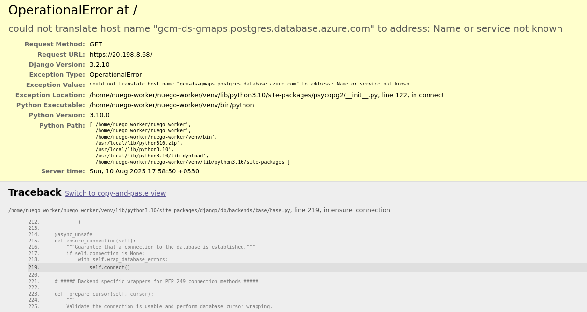

# Debug Mod Nedir
"debug=true" kullanımı, bir yazılıma hata ayıklama modunu etkinleştirmek için kullanılan bir tekniktir. Bu mod etkinleştirildiğinde, program çalışma zamanında neler olduğunu daha ayrıntılı şekilde gösterir; hata mesajları, uyarılar ve diğer hata ayıklama bilgileri gibi. "debug=true" bayrağı genellikle uygulamanın geliştirme aşamasında kullanılır. Geliştiriciler, kodu test edip hataları ayıklarken bu mod sayesinde sorunları hızlıca tespit edip çözebilir.

# Güvenlik Riskleri
"debug=true" productio ortamında kullanılırsa ciddi güvenlik riskleri oluşturur. Hata ayıklama modu detaylı hata mesajları ve diğer hassas bilgileri açığa çıkarır. Bu bilgiler saldırganların uygulamanın iç işleyişini anlaması, zafiyetleri tespit edip sömürmesi ve yetkisiz erişim sağlaması için kullanılabilir. 

# Django Debug Sayfalarından Sızdırılan Veriler
debug=true aktifken, saldırganlar aşağıdaki kritik bilgilere kolayca erişebilir:
    - Full Stack Trace:

        - Kodun nasıl çalıştığını, hataların nerede oluştuğunu ve istek/yanıtlardaki olası değişkenleri gösterir.

        - Saldırganlar buradan kod yürütme yollarını tespit edip, SQL injection veya path traversal gibi hedeflenmiş saldırılar planlayabilir.

        Örnek:
        - 

    - İstek ve Yanıt Verileri:

        - Çerezler, CSRF token’ları ve başlık bilgileri elde edilir.

        - Bu bilgiler, oturum çalma, CSRF saldırıları ve sosyal mühendislik saldırıları için kullanılır.

    - Kurulu Uygulamalar ve Middleware:

        - INSTALLED_APPS ve middleware listesi görülür.

        - Saldırganlar, zayıf veya yamalanmamış üçüncü taraf bileşenleri tespit edebilir.

    - Veritabanı ve Dosya Yolları:

        - Veritabanı motoru, dosya dizinleri ve şema bilgileri açığa çıkabilir.

        - Saldırganlar, bilinen veritabanı açıklarını veya dosya sistemi zafiyetlerini istismar edebilir.