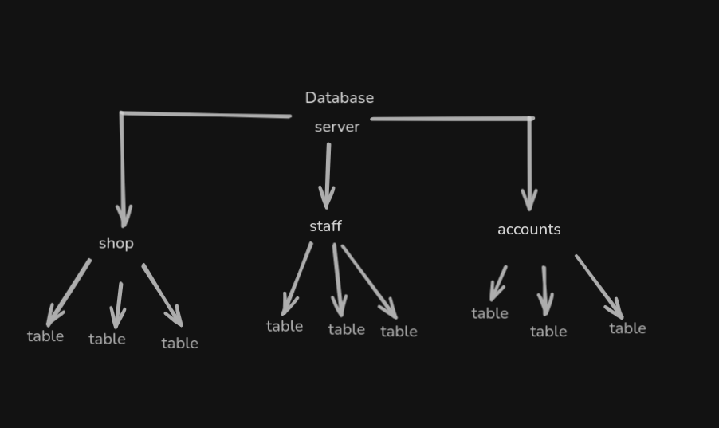
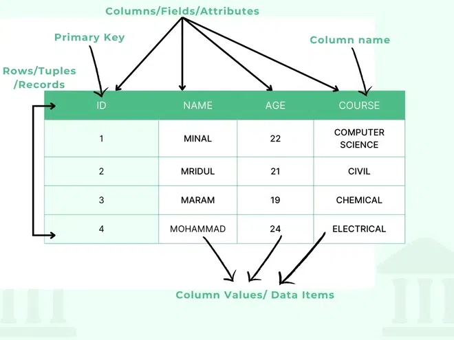

# SQL Injection
SQL Injection, kullanıcıdan alınan verinin doğrudan SQL sorgusuna eklenmesi ve yeterli filtreleme/sanitizasyon yapılmaması sonucunda ortaya çıkan bir güvenlik zafiyetidir.
Bu zafiyetin istismarı ile saldırgan:
- Veritabanındaki tüm verileri okuyabilir,
- Veri ekleyebilir/güncelleyebilir/silebilir,
- Yetkileri aşarak hassas bilgilere erişebilir,
- Bazı durumlarda işletim sistemi seviyesinde komut çalıştırabilir.

# SQL Nedir
SQL (Structured Query Language), ilişkisel veritabanlarında depolanan verileri yönetmek ve sorgulamak için kullanılan standart bir dildir; temel olarak verileri okuma (SELECT), ekleme (INSERT), güncelleme (UPDATE) ve silme (DELETE) işlemlerini yapmayı, ayrıca tablolar ve veritabanı yapısını oluşturma (CREATE), değiştirme (ALTER) ve silme (DROP) gibi işlemlerle veritabanını düzenlemeni sağlar. SQL bilmek, SQL Injection (SQLi) gibi zafiyetleri anlamanın temelidir çünkü bu saldırılar, veritabanıyla etkileşim şeklimizi manipüle ederek çalışır.

# Veritabanı Nedir
Veritabanı, verileri düzenli ve erişilebilir bir şekilde saklamaya yarayan yapıdır.
Bir veritabanı DBMS (Database Management System) tarafından yönetilir.
DBMS’ler temelde ikiye ayrılır:
- İlişkisel (Relational) – Örn: MySQL, PostgreSQL, MSSQL, Oracle
- İlişkisel olmayan (NoSQL) – Örn: MongoDB, Redis, Cassandra
Bu yazının odak noktası ilişkisel veritabanlarıdır.
Örneğin, "mağaza" adında bir veritabanınız var ve kayıtlı kullanıcılar ile aldığınız siparişleri saklamak istiyorsunuz. Bu bilgileri tablolar kullanarak depolarsınız.
Örnek şema:


# Tablo Nedir
Tablolar, sütunlar (columns) ve satırlardan (rows) oluşur.
- Sütunlar: Depolanacak veri türünü tanımlar (örn: id, isim, email).
- Satırlar: Bu sütunlara karşılık gelen veri kayıtlarını içerir.
Örnek tablo yapısı:


# SQL Komutları
## SELECT
SELECT komutu, veritabanından veri sorgulamak için kullanılır.
Örnek:
```sql
SELECT * FROM users;
```
- SELECT → Veri almak istediğimizi belirtir.

- \* (yıldız) → Tüm sütunları seçmek istediğimizi söyler.

- FROM users → users adındaki tablodan veri alınacağını belirtir.

Aşağıdaki sorgu yine tüm sütunları döndürür, ancak LIMIT 1 ifadesi sadece 1 satır getirilmesini sağlar:
```sql
SELECT * FROM users LIMIT 1;
```

WHERE ifadesi, belirli koşullara uyan kayıtları filtrelemek için kullanılır:
```sql
SELECT * FROM users where username='admin';
```

Bu sadece kullanıcı adının admine eşit olduğu satırları döndürür.

LIKE ifadesi, tam eşleşme yerine belirli bir desenle (pattern) arama yapmamızı sağlar. % sembolü, sıfır veya daha fazla karakter yerine geçer:
```sql
SELECT * FROM users where username LIKE 'a%';
```

## UNION
UNION ifadesi, iki veya daha fazla SELECT sorgusunun sonuçlarını birleştirerek tek bir sonuç seti olarak döndürür. Bu sayede birden fazla tablodan veya sorgudan veri alabilirsin.

Kurallar:
- UNION ifadesinden önceki ve sonraki SELECT sorguları aynı sayıda sütun döndürmelidir.
- Bu sütunların veri tipleri (data types) uyumlu olmalıdır (örneğin, birinde INT diğerinde VARCHAR olmamalı).

```sql
SELECT name, address, city, postcode FROM customers
UNION
SELECT company, address, city, postcode FROM suppliers;
```

## INSERT
INSERT ifadesi, bir tabloya yeni veri satırı eklemek için kullanılır.

```sql
INSERT INTO users (username, password) VALUES('bob', 'password')
```

- INSERT INTO users → Veriyi ekleyeceğimiz tabloyu belirtir.
- (username, password) → Eklenecek sütunları tanımlar.
- VALUES ('bob', 'password') → Bu sütunlara karşılık gelen verileri belirtir.

## UPDATE
UPDATE ifadesi veritabanına bir veya daha fazla veri satırını güncellemek istediğimizi belirtir.

```sql
UPDATE users SET username='root', password='pass123' where username='admin';
```

- UPDATE users → users tablosundaki kayıtların güncelleneceğini belirtir.
- SET username='root', password='pass123' → Güncellenecek sütunlar ve yeni değerleri burada belirtilir; bu örnekte username "root" ve password "pass123" olarak değiştirilir.
- WHERE username='admin' → Sadece username değeri "admin" olan kayıtlar üzerinde güncelleme yapılır. Bu koşul olmazsa, tablodaki tüm satırlar güncellenir.

## DELETE 
DELETE ifadesi, bir tabloda bulunan bir veya daha fazla kayıt satırını silmek için kullanılır. SELECT sorgusuna benzer şekilde WHERE koşulu ile hangi satırların silineceği belirtilir.
```sql
DELETE FROM users where username='martin';
```

# SQL Injection Çalışma Prensibi
Örneğin URL şu olsun:
```url
https://example.com/blog?id=1
```

Bu URL'deki id parametresi, web uygulamasının veritabanından blog yazısını çekmek için kullandığı SQL sorgusuna doğrudan ekleniyor olabilir:
```sql
SELECT * FROM blog WHERE id=1 AND private=0 LIMIT 1;
```

Diyelim ki, id=2 olan makale özel (private=1) ve bu yüzden site üzerinde görüntülenmiyor. Saldırgan URL parametresine aşağıdaki gibi kötü niyetli bir giriş yapabilir:
```url
https://example.com/blog/id=2;--
```

Bu durumda sorgu şu şekilde değişir:
```sql
SELECT * FROM blog WHERE id=2;-- AND private=0 LIMIT 1;
```

Burada -- SQL’de yorum satırı işaretidir, sonrasındaki AND private=0 LIMIT 1 kısmı yok sayılır ve sorgu sadece id=2 şartıyla çalışır. Böylece özel makale engel atlatılarak çekilebilir.

Bu tip saldırılara in-band SQL Injection denir ve saldırgan, veri tabanından direkt yanıt alır. SQL Injection’ın üç ana türü vardır:
- In-band (en yaygın),
- Blind (veri doğrudan görünmez, mantıksal sonuçlara göre çıkarım yapılır),
- Out-of-band (veri farklı kanallarla elde edilir).

## In-Band SQL Injection
In-Band SQL Injection, saldırganın aynı kanal üzerinden hem zafiyeti sömürmesini hem de sonuçları almasını sağlar. En yaygın ve en kolay istismar edilen SQLi türüdür. Örneğin, web uygulamasına enjekte edilen zararlı sorgu sonucunda veri doğrudan sayfa çıktısında veya hata mesajlarında görünür.

## Error Based SQL Injection
Error-Based SQL Injection, veritabanının hata mesajlarını doğrudan kullanıcıya döndürmesi sayesinde veritabanı yapısı, tablolar, sütunlar gibi hassas bilgilerin çıkarılmasına olanak sağlar. Hata mesajları saldırgana bilgi sızıntısı yapar ve genellikle yapı keşfi için kullanılır.

# UNION Based SQL Injection
Bu SQL Injection türü SQL UNION operatörünü bir SELECT ifadesi ile birleştirerek sayfaya ek sonuçlar döndürmek için kullanılır. Bu yöntem geniş miktarda veri çıkartmanın en yaygın yoludur.