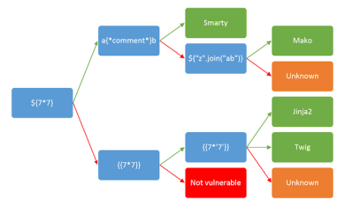

# SSTI Nedir
Server-Side Template Injection , web uygulamalarında kullanılan template engine’lerin kullanıcı girdilerini doğru şekilde filtrelemeden şablona dahil etmesi sonucunda oluşan bir güvenlik zafiyetidir.

Şablon motorları (ör. Jinja2, Twig, Freemarker) dinamik içerik oluşturmak için kullanılır. Amaç, backend verilerini HTML veya başka formatlara kolayca gömmektir. Eğer geliştirici, kullanıcıdan aldığı girdiyi doğrudan şablon içine koyarsa, saldırgan template engine’in kendi scripting yeteneklerini kötüye kullanarak:

- Bilgi sızdırma (ör. sistem path, config değerleri)
- Uzaktan kod çalıştırma (RCE)

gibi saldırılar gerçekleştirebilir.

Örneğin:
```py
from flask import Flask, request, render_template_string

app = Flask(__name__)

@app.route("/")
def index():
    user = request.args.get("name", "Guest")
    return render_template_string("Hello " + user)
```

Burada ?name={{7*7}} şeklinde bir istek gönderildiğinde, çıktı Hello 49 olacaktır. Bu da SSTI’nin en basit PoC’lerinden biridir.

# Template Engine Nedir
Template engine, backend verilerini HTML gibi çıktı formatlarına gömmeyi kolaylaştıran bir yapıdır. Örneğin, kullanıcıya ait bir isim değişkenini doğrudan HTML’e basmak için:
```jinja
Hello {{ username }}
```

Bu ifade, şablon motoru tarafından çalıştırılır ve username değişkeninin değeriyle değiştirilir.

Kritik nokta: Template engine’ler sadece değişken yerleştirme yapmaz. Çoğu motorun kontrol yapıları (if, for), fonksiyon çağırma, matematiksel işlem gibi özellikleri vardır. Bu yüzden basit string replace mekanizmasından çok daha güçlüdürler.

## Neden {{7*7}} → 49 Döner
Çünkü {{ ... }} ifadesi, template engine’de “evaluate expression” anlamına gelir.

- Kullanıcı ?name={{7*7}} gönderir
- Template engine bu ifadeyi alır ve Python/Jinja2’nin eval mantığıyla çalıştırır
- 7*7 ifadesi hesaplanır → 49

Çıktı HTML’e şu şekilde basılır:
```
Hello 49
```

Bu PoC, iki şeyi kanıtlar:
- Kullanıcı girdisi doğrudan şablona enjekte edilebiliyor.
- Template engine, sadece string basmakla kalmıyor, kod çalıştırmaya izin veriyor.

# Diğer Template Engine Örnekleri
Farklı backend teknolojileri farklı şablon motorları kullanır ve SSTI testinde PoC ifadeleri değişiklik gösterebilir:

- Python (Jinja2): {{7*7}} → 49
- PHP (Twig): {{7*7}} → 49
- Java (Freemarker): ${7*7} → 49
- Java (Velocity): #set($x = 7*7) $x → 49
- .NET (Razor): @(7*7) → 49

Pentester açısından bu fark önemlidir çünkü hangi engine kullanıldığını anladığında payloadlarını uyarlaması gerekir.

Farklı şablon motorlarını test etmek için aşağıdaki akış kullanılabilir:

