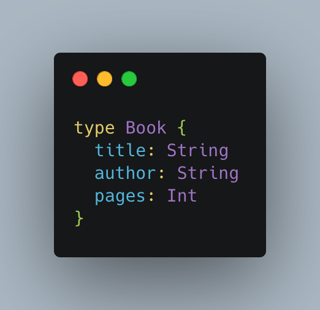

# GraphQL
GraphQL bir sorgu dilidir. Yani, SQL gibi, bir veritabanına ya da herhangi bir bilgi sistemine erişmek için kullanılan bir dildir. Schema, bir GraphQL API'nin merkez öğesidir. Sunucu ile istemci arasındaki tüm olası etkileşimleri tanımlar. Bir API için yalnızca bir schema vardır ve bu şema bir referans görevi görür. Schema, istemcinin sunucuya gönderebileceği sorgu türlerini, sunucudan alınabilecek veri türlerini ve bu farklı veri türleri arasındaki ilişkileri belirtir.

Skaler tip, GraphQL’deki en temel veri tipidir. Bir alan için atanan ilkel (primitive) veriyi temsil eder:
- String: karakter dizisi
- Int: tamsayı
- Float: ondalıklı sayı
- Boolean: doğru/yanlış değeri
- ID: benzersiz tanımlayıcı

Bu nesne sırasıyla String, String ve Int tipinde üç alana sahiptir:
- 